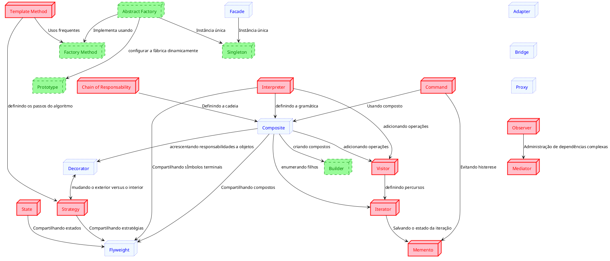

# Padrões de Projeto de Software Orientado a Objetos

## Introdução

A idéia de padrões foi apresentada por Christopher Alexander em 1977 no contexto de Arquitetura (de prédios e cidades):
- Problemas semelhantes com soluções diferentes
- Reinventando a Roda

## Conceito

Também conhecidos como _Padrões de Desenho de Software OO_ ou simplesmente como _Padrões_.

::: tip Definição
Cada padrão descreve um problema que ocorre repetidas vezes em nosso ambiente, e então descreve o núcleo da solução para aquele problema, de tal maneira que pode-se usar essa solução milhões de vezes sem nunca fazê-la da mesma forma duas vezes [^Alexander] 
::: 

::: tip Definição
Os padrões de projeto são descrições de objetos que se comunicam e classes que são customizadas para resolver um problema genérico de design em um contexto específico [^GAMMA]
::: 

### Outras definições

- Maneira testada ou documentada de alcançar um objetivo qualquer.
  - Padrões são comuns em várias áreas da engenharia.
- Design Patterns, ou Padrões de Projeto
  - Padrões para alcançar objetivos na engenharia de software usando classes e métodos em linguagens orientadas a objeto
  - Inspirado em "A Pattern Language"de Christopher Alexander, sobre padrões de arquitetura de cidades, casas e prédios
  - "Design Patterns"de Erich Gamma, John Vlissides, Ralph Jonhson e Richard Helm, conhecidos como "The Gang of Four", ou GoF, descreve 23 padrões de projeto úteis
- Aprender com a experiência dos outros
  - Identificar problemas comuns em engenharia de software e utilizar soluções testadas e bem documentadas
  - Utilizar soluções que têm um nome: facilita a comunicação, compreensão e documentação
- Aprender a programar bem com orientação a objetos
  - Os 23 padrões de projeto "clássicos" utilizam as melhores práticas em OO para atingir os resultados desejados
- Desenvolver software de melhor qualidade 
  - Os padrões utilizam eficientemente polimorfismo, herança, modularidade, composição, abstração para construir código reutilizável, eficiente, de alta coesão e baixo acoplamento
- Vocabulário comum
  - Faz o sistema ficar menos complexo ao permitir que se fale em um nível mais alto de abstração
- Ajuda na documentação e na aprendizagem
  - Conhecendo os padrões de projeto torna mais fácil a compreensão de sistemas existentes
  - "As pessoas que estão aprendendo POO freqüentemente reclamam que os sistemas com os quais trabalham usam herança de forma convoluida e que é difí cil de seguir o fluxo de controle. Geralmente a causa disto é que eles não entendem os padrões do sistema"[GoF]
  - Aprender os padrões ajudam um novato a agir mais como um especialista
- Uma prática adjunta aos métodos existentes
  - Mostram como usar práticas primitivas
  - Descrevem mais o porquê do design
  - Ajudam a converter um modelo de análise em um modelo de implementação
- Um alvo para refatoramento
  - Captura as principais estruturas que resultam do refatoramento
  - Uso de patterns desde o iní cio pode diminuir a necessidade de refatoramento
## Elementos de um padrão
- Nome
- Problema
  - Quando aplicar o padrão, em que condições?
- Solução
    - Descrição abstrata de um problema e como usar os elementos disponíveis (classes e objetos) para solucioná-lo
- Consequências
  - Custos e benefícios de se aplicar o padrão
  - Impacto na flexibilidade, extensibilidade, portabilidade e eficiência do sistema

<table>
<caption>Tabela de padrões do Gof </caption>
  <tr>
    <td colspan="2" rowspan="2"></td>
    <td colspan="3" style="text-align:center">Propósito</td>
  </tr>
  <tr>
    <td>De Criação</td>
    <td>Estrutural</td>
    <td>Comportamental</td>
  </tr>
  <tr>
    <td rowspan="2">Escopo</td>
    <td>Classe</td>
    <td class="criacao">Factory Method</td>
    <td class="estrutural">Adapter</td>
    <td class="comportamental">Interpreter Template Method</td>
  </tr>
  <tr>
    <td>Objetivo</td>
    <td class="criacao">Abstract Factory Builder Prototype Singleton</td>
    <td class="estrutural">Adapter Bridge Composite Decorator Facade Flyweight Proxy</td>
    <td class="comportamental">Chain of Responsability Command Iterator Mediator Memento Observer State Strategy Visitor</td>
  </tr>
</table>

<figure>

<figcaption> Relação entre os padrões do Gof </figcaption>
</figure>

## Referências

<!-- @include: ../includes/bib.md -->