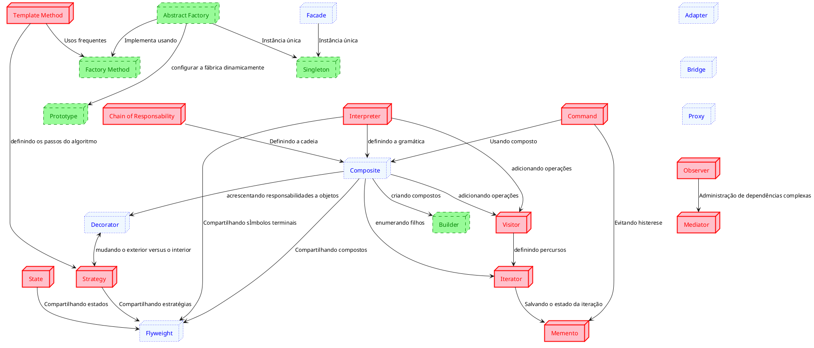
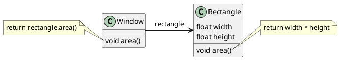

# Padrões de Projeto de Software Orientado a Objetos

## Introdução

A ideia de padrões foi apresentada por Christopher Alexander em 1977 no contexto de Arquitetura (de prédios e cidades):
- Problemas semelhantes com soluções diferentes
- Reinventando a Roda

## Conceito

Também conhecidos como _Padrões de Desenho de Software OO_ ou simplesmente como _Padrões_.

::: tip Definição
Cada padrão descreve um problema que ocorre repetidas vezes em nosso ambiente, e então descreve o núcleo da solução para aquele problema, de tal maneira que pode-se usar essa solução milhões de vezes sem nunca fazê-la da mesma forma duas vezes [^Alexander] 
::: 

::: tip Definição
Os padrões de projeto são descrições de objetos que se comunicam e classes que são customizadas para resolver um problema genérico de design em um contexto específico [^GAMMA]
::: 

### Outras definições

- Maneira testada ou documentada de alcançar um objetivo qualquer.
  - Padrões são comuns em várias áreas da engenharia.
- Design Patterns, ou Padrões de Projeto
  - Padrões para alcançar objetivos na engenharia de software usando classes e métodos em linguagens orientadas a objeto
  - Inspirado em "A Pattern Language"de Christopher Alexander, sobre padrões de arquitetura de cidades, casas e prédios
  - "Design Patterns"de Erich Gamma, John Vlissides, Ralph Jonhson e Richard Helm, conhecidos como "The Gang of Four", ou GoF, descreve 23 padrões de projeto úteis
- Aprender com a experiência dos outros
  - Identificar problemas comuns em engenharia de software e utilizar soluções testadas e bem documentadas
  - Utilizar soluções que têm um nome: facilita a comunicação, compreensão e documentação
- Aprender a programar bem com orientação a objetos
  - Os 23 padrões de projeto "clássicos" utilizam as melhores práticas em OO para atingir os resultados desejados
- Desenvolver software de melhor qualidade 
  - Os padrões utilizam eficientemente polimorfismo, herança, modularidade, composição, abstração para construir código reutilizável, eficiente, de alta coesão e baixo acoplamento
- Vocabulário comum
  - Faz o sistema ficar menos complexo ao permitir que se fale em um nível mais alto de abstração
- Ajuda na documentação e na aprendizagem
  - Conhecendo os padrões de projeto torna mais fácil a compreensão de sistemas existentes
  - "As pessoas que estão aprendendo POO frequentemente reclamam que os sistemas com os quais trabalham usam herança de forma convoluida e que é difícil de seguir o fluxo de controle. Geralmente a causa disto é que eles não entendem os padrões do sistema"[^GAMMA]
  - Aprender os padrões ajudam um novato a agir mais como um especialista
- Uma prática adjunta aos métodos existentes
  - Mostram como usar práticas primitivas
  - Descrevem mais o porquê do design
  - Ajudam a converter um modelo de análise em um modelo de implementação
- Um alvo para refatoramento
  - Captura as principais estruturas que resultam do refatoramento
  - Uso de patterns desde o início pode diminuir a necessidade de refatoramento
## Elementos de um padrão
- Nome
- Problema
  - Quando aplicar o padrão, em que condições?
- Solução
    - Descrição abstrata de um problema e como usar os elementos disponíveis (classes e objetos) para solucioná-lo
- Consequências
  - Custos e benefícios de se aplicar o padrão
  - Impacto na flexibilidade, extensibilidade, portabilidade e eficiência do sistema

<table>
<caption>Tabela de padrões do Gof </caption>
  <tr>
    <td colspan="2" rowspan="2"></td>
    <td colspan="3" style="text-align:center">Propósito</td>
  </tr>
  <tr>
    <td>De Criação</td>
    <td>Estrutural</td>
    <td>Comportamental</td>
  </tr>
  <tr>
    <td rowspan="2">Escopo</td>
    <td>Classe</td>
    <td class="criacao"><ul>
      <li>Factory Method</li></ul></td>
    <td class="estrutural"><ul>
      <li>Adapter</li></ul></td>
    <td class="comportamental">
                            <ul>
                              <li>Interpreter</li>
                              <li>Template Method</li>
                            </ul></td>
  </tr>
  <tr>
    <td>Objeto</td>
    <td class="criacao">
      <ul><li>Abstract Factory</li><li>Builder</li><li>Prototype</li><li>Singleton</li> </ul></td>
    <td class="estrutural"><ul><li>Adapter</li><li>Bridge</li><li>Composite</li><li>Decorator</li><li>Facade</li><li>Flyweight</li><li>Proxy</li></ul></td>
    <td class="comportamental"><ul><li>Chain of Responsability</li><li>Command</li><li>Iterator</li><li>Mediator</li><li>Memento</li><li>Observer</li><li>State</li><li>Strategy</li><li>Visitor</li></ul></td>
  </tr>
</table>

<figure>

<figcaption> Relação entre os padrões do Gof </figcaption>
</figure>

## Visão geral dos Padrões do Gof
### Criação
- Factory Method 
  - Definir uma interface para criar um objeto mas deixar que subclasses decidam que classe instanciar 
- Abstract Factory 
  - Prover interface para criar famílias de objetos relacionados ou dependentes sem especificar suas classes concretas 
- Builder 
  - Separar a construção de objeto complexo da representação para criar representações diferentes com mesmo processo 
- Prototype 
  - Especificar tipos a criar usando uma instância como protótipo e criar novos objetos ao copiar este protótipo 
- Singleton 
  - Garantir que uma classe só tenha uma única instância, e prover um ponto de acesso global a ela 
### Estrutural
- Adapter 
  - Converter a interface de uma classe em outra interface esperada pelos clientes.
- Bridge 
  - Desacoplar uma abstração de sua implementação para que os dois possam variar independentemente 
- Composite 
  - Permitir o tratamento de objetos individuais e composições desses objetos de maneira uniforme 
- Decorator 
  - Anexar responsabilidades adicionais a um objeto dinamicamente 
- Façade 
  - Oferecer uma interface única de nível mais elevado para um conjunto de interfaces de um subsistema 
- Flyweight 
  - Usar compartilhamento para suportar eficientemente grandes quantidades de objetos complexos 
- Proxy 
  - Prover um substituto ou ponto através do qual um objeto possa controlar o acesso a outro 
### Comportamental
- Observer 
  - Definir uma dependência um-para-muitos entre objetos para que quando um objeto mudar de estado, os seus dependentes sejam notificados e atualizados automaticamente 
- Mediator 
  - Definir um objeto que encapsula a forma como um conjunto de objetos interagem 
- Chain of Responsibility 
  - Compor objetos em cascata para, através dela, delegar uma requisição até que um objeto a sirva 
- Memento 
  - Externalizar o estado interno de um objeto para que o objeto possa ter esse estado restaurado posteriormente 
- Template Method 
  - Definir o esqueleto de um algoritmo dentro de uma operação, deixando alguns passos a serem preenchidos pelas subclasses 
- State 
  - Permitir a um objeto alterar o seu comportamento quanto o seu estado interno mudar 
- Strategy 
  - Definir uma família de algoritmos, encapsular cada um, e fazê-los intercambiáveis 
- Command 
  - Encapsular requisição como objeto, para clientes parametrizarem diferentes requisições, filas, e suportar operações reversíveis 
- Interpreter 
  - Dada uma linguagem, definir uma representação para sua gramática junto com um interpretador 
- Iterator 
  - Prover uma maneira de acessar elementos de um objeto agregado sequencialmente sem expor sua representação interna 
- Visitor 
  - Representar uma operação a ser realizada sobre os elementos de uma estrutura de objetos 

## Como os padrões solucionam problemas?
### Quais os objetos mais apropriados? 

- A tarefa de decompor um sistema em objetos não é trivial 
- É preciso levar em conta fatores como encapsulamento, granularidade, dependência, flexibilidade, performance, reuso, etc. 
- Muitos objetos são descobertos na fase de análise, mas muitos não têm paralelo no mundo real 
- Design patterns ajudam a identificar as abstrações menos óbvias e objetos que podem representá-las 
- Exemplo: objetos que representam um algoritmo ou um estado (raramente aparecem na fase de análise) 
### Qual a granularidade ideal? 
- Objetos podem representar qualquer coisa 
- Um objeto pode representar todos os detalhes até o hardware ou ser a aplicação inteira 
- Design patterns oferecem várias soluções 
- Façade descreve como representar subsistemas inteiros como um único objeto 
- Flyweight descreve como suportar grandes quantidades de objetos nas menores granularidades 
- Abstract Factory, Builder, Visitor e Command limitam a responsabilidade de objetos 
### Como especificar interfaces? 
- Uma interface é o conjunto de todas as assinaturas* definidas pelas operações de um objeto 
- Objetos são conhecidos apenas através de suas interfaces em sistemas orientados a objetos 
- A interface de um objeto nada diz sobre sua implementação, que pode ser determinada em tempo de execução 
- Design patterns ajudam a definir interfaces ao identificar seus elementos-chave e tipos de dados que são passados 
- Podem restringir o que se pode colocar em uma interface 
- Podem especificar relacionamentos entre interfaces 
- Podem estabelecer regras para criação de interfaces 
### Como especificar implementações 
- Objetos só devem ser manipulados em termos de uma interface definida por classes abstratas (ou interfaces Java) 
- Clientes não devem conhecer os tipos concretos dos objetos, nem das classes que implementam esses objetos. Só devem conhecer as classes abstratas que definem a interface 
- Princípio de design reutilizável: programe para uma interface, nunca para uma implementação 
- Design patterns oferecem formas de instanciar classes concretas em outras partes do sistema 
- Padrões de construção abstraem o processo de criação de objetos oferecendo um meio transparente para associar uma interface com uma implementação. 
### Como fazer o reuso funcionar 
- Deve-se usar herança de classes com cautela. Há quebra de encapsulamento na herança porque ela expõe a subclasse a detalhes da implementação da superclasse 
- Dando preferência à composição de objetos sobre herança de classes ajuda a manter o encapsulamento e o foco de cada classe em uma única tarefa 
- Princípio de design reutilizável: dê preferência à composição de objetos sobre herança de classe 
- Design patterns usam delegação para tornar a composição tão poderosa para reuso quando a herança 
- Dois objetos estão envolvidos para tratar uma requisição: o objeto que recebe a requisição passa uma referência de si mesmo para o objeto delegado
- Exemplo: Janela _tem_ um retângulo (em vez de ser um) 
<figure>

<figcaption> Representação de Delegação </figcaption>
</figure>

- Vantagem: facilita a composição de comportamentos em tempo de execução 
- Desvantagem: possível performance menor; código mais difícil de acompanhar. 
  - Delegação é uma boa escolha de design somente quando ela simplifica mais que complica! 
  - Funciona melhor quando usada de forma padrão. Patterns!
### Como distinguir estruturas estáticas (compile-time) e dinâmicas (run-time)? 
- A estrutura em tempo de execução de um programa orientado a objetos mantém pouca semelhança com sua estrutura de código: código não revela como sistema funciona! 
- Estrutura estática: hierarquias fixas e imutáveis 
- Estrutura dinâmica: redes mutáveis de objetos interagindo 
- Exemplo: agregação e associação são implementadas da mesma forma (em código) mas se mostram muito diferentes em tempo de execução 
- Vários design patterns capturam a distinção entre estruturas run-time e compile-time. 
- As estruturas não são óbvias pelo código. É preciso entender os padrões!
### Como antecipar mudanças? 
- Os padrões viabilizam o desenvolvimento de código mais robusto diante de possíveis mudanças e refatoramento do código 
- Padrões promovem desacoplamento e permitem que algum aspecto da estrutura do sistema varie independentemente de outros aspectos 
- Evita redesign e readaptação de código nas situações previstas pelo padrão aplicado 
- Reduz risco e possíveis custos futuros 
- Na maior parte dos casos, o investimento não implica em altos custos (risco) no presente, já que contribuem para a legibilidade e qualidade do código.

## Oito causas comuns de redesign e padrões que os evitam 
1. Criação de objeto especifica classe explicitamente
    - O sistema está preso a uma implementação específica 
    - Solução: criar objetos indiretamente com Abstract Factory, Factory Method ou Prototype 
  1. Dependência em operações específicas
      - O sistema só tem uma forma de satisfazer uma requisição 
      - Solução: evitar ações "hard-coded" com Chain of Responsibility ou Command 
  1. Dependência em plataforma de H/W ou S/W
      - O software precisa ser portado a outras plataformas 
      - Solução: limitar dependências com Abstract Factory ou Bridge 
  1. Dependência em representações ou implementações de objetos
      - Clientes que sabem como um objeto é implementado, representado ou armazenado podem ter que ser alterados se o objeto mudar 
      - Solução: isolar cliente com Abstract Factory, Bridge, Memento ou Proxy 
  1. Dependências de algoritmo
      - Mudanças de algoritmo são frequentes. Objetos que dependem de um algoritmo precisam mudar quando o algoritmo mudar. 
      - Solução: isolá-los com Builder, Iterator, Strategy, Template Method ou Visitor 
  1. Forte acoplamento
      - Classes fortemente acopladas são difíceis de reusar, testar, manter, etc. 
      - Solução: enfraquecer o acoplamento com Abstract Factory, Bridge, Chain of Responsibility, Command, Façade, Mediator ou Observer 
  1. Extensão de funcionalidade através de subclasses
      - Herança é difícil de usar; composição dificulta compreensão. 
      - Solução: usar padrões que implementam bem herança e composição como Bridge, Chain of Responsibility, Composite, Decorator, Observer ou Strategy 
  1. Incapacidade de alterar classes convenientemente
      - Classes inaccessíveis, incompreensíveis ou difíceis de alterar 
      - Solução: usar Adapter, Decorator ou Visitor 

## Tipos de software
- Aplicações
  - Prioridades: reuso interno, manutenção, extensão 
- Toolkits, APIs, bibliotecas
  - Conjunto de classes reutilizáveis de propósito geral. Não impõem design 
  - Prioridade: amplo reuso de código 
- Frameworks
  - Dita a arquitetura da aplicação. Requer que usuário aprenda o framework e inclua código e configuração. 
  - Prioridade: amplo reuso de design 
  - Geralmente são fortemente baseados em padrões. Quem conhecem os padrões entende o framework mais facilmente. 

## Referências

<!-- @include: ../includes/bib.md -->