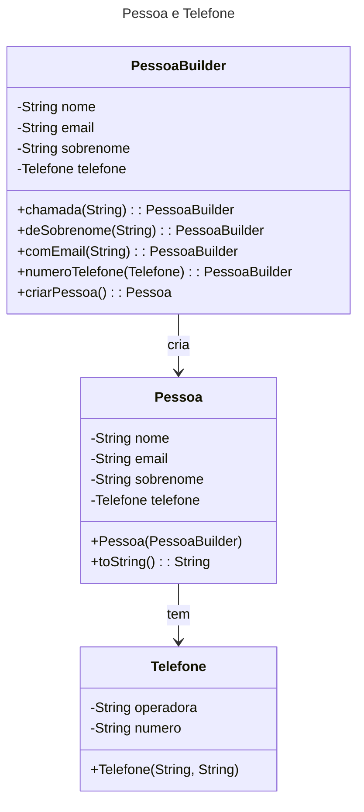
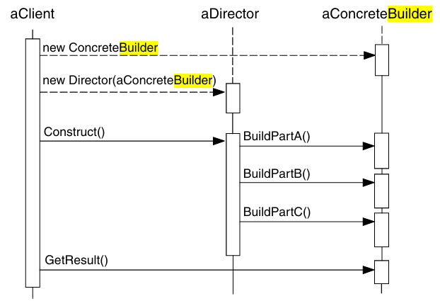
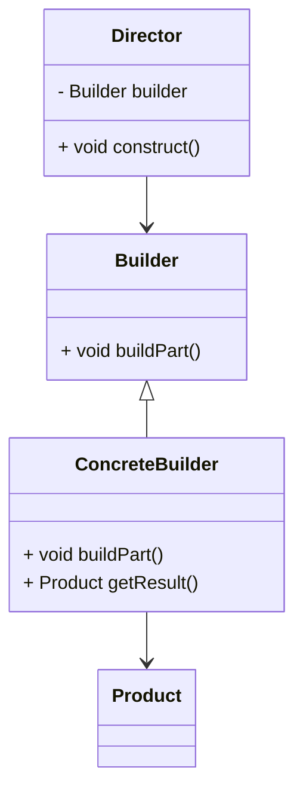

# Builder

## Builder - gabrielflb

### Intenção

- A intenção do padrão Builder é separar a construção de um objeto complexo da sua representação, permitindo que o mesmo processo de construção possa criar diferentes representações.

### Também Conhecido Como

- Construtor

### Motivação

- Imagine um objeto complexo que pode ser construído de várias maneiras. A classe construtora precisa lidar com diferentes configurações e opções, tornando o código complicado e difícil de manter. O padrão Builder resolve isso ao separar o processo de construção em passos mais gerenciáveis e permitir que diferentes partes de um objeto sejam configuradas de maneira modular.


### Aplicabilidade
#### Use o padrão Builder quando:

- A criação de um objeto envolve muitos passos e configurações complexas.
- O objeto precisa ser criado de diferentes maneiras ou representações.
- Você quer evitar construtores longos e complexos com muitos parâmetros opcionais.
- Builder com interface fluente

  
### Estrutura
#### O padrão Builder normalmente envolve os seguintes componentes:

- Builder: Interface ou classe abstrata que define todos os passos de criação que devem ser implementados.
- ConcreteBuilder(contrução concreta/real): Implementa a interface Builder e fornece a implementação específica dos passos de construção.
- Produto: O objeto complexo a ser construído.
- Diretor: (Opcional) Gerencia o processo de construção utilizando o Builder.




### Participantes
- Pessoa possui um relacionamento de "tem" com Telefone
- Uma Pessoa pode ter um atributo do tipo Telefone.
- PessoaBuilder cria instâncias de Pessoa:
- O PessoaBuilder é usado para construir uma nova Pessoa com os atributos desejados.
  
### Consequências:
#### Vantagens
- Separa a criação da utilização(principio da responsabilidade unica).
- Permite criar diferentes representações de um objeto.
-  A criação do objeto pode variar de acordo com a necessidade
- Código de construção é mais modular e fácil de manter.
- Mantem o principio Aberto-Fechado (OCP) podendo criar varios objetos Builders diferentes.
#### Desvantagens
- Introduz complexidade adicional.
- Pode ser exagerado para objetos simples.


### Implementação
- Para implementar o padrão Builder, siga estes passos:
- Crie uma interface ou classe abstrata Builder que define os métodos para a construção das partes do produto.
- Crie uma ou mais classes ConcreteBuilder que implementam a interface Builder.
- Crie uma classe Produto que representa o objeto complexo a ser construído.
- Opcionalmente, crie uma classe Diretor que usa o Builder para construir o Produto por etapas desejadas.

### Usos Conhecidos
- Construção de documentos complexos em diferentes formatos (HTML, PDF, DOC, etc.).
- Configuração de objetos em jogos, como personagens ou níveis, onde diferentes partes precisam ser configuradas.

### Padrões Relacionados
- Abstract Factory: O Builder pode ser considerado uma variação mais flexível do Abstract Factory.
- Composite: Pode ser usado com o Builder para construir árvores de objetos complexos.
- Prototype: O Builder pode ser usado em conjunto com o Prototype para construir objetos complexos a partir de protótipos.

## Builder - LuisMiguelADS

### Intenção

Separar a construção de um objeto complexo da sua representação de modo que o mesmo processo de construção possa criar diferentes representações.

---

### Também conhecido como 

Constructor

---

### Motivação

Um leitor de um documento em RTF (Rich Text Format) deveria ser capaz de converter RTF em muitos formatos de texto. O leitor poderia converter documentos RTF em texto ASCII comum ou widget de texto, que possa ser editado interativamente. O problema, contudo, é que o número de conversões possíveis é aberto. Por isso, deve ser fácil acrescentar uma nova conversão sem modificar o leitor.

Uma solução é configurar a classe RTFReader com um objeto TextConverter que converte RTF para uma outra representação de textos. À medida que o RTFReader analisa o documento RTF, ele usa o objeto TextConverter para efetuar a conversão. Sempre que o RTFReader reconhece um símbolo RTF (texto simples, ou uma palavra de controle do RTF), ele emite uma solicitação para o TextConverter para converter esse símbolo. Os objetos TextConverter são responsáveis tanto por efetuar a conversão dos dados como pela representação do símbolo num formato particular.
    
As subclasses de TextConverter se especializam em diferentes conversões e formatos. Por exemplo, um ASCIIConverter ignora solicitações para converter qualquer coisa, exceto texto simples. Por outro lado, um TeXConverter implementará operações para todas as solicitações visando produzir uma representação TEX que capture toda a informação estilística do texto. Um TextWidgetConverter produzirá um objeto para uma interface de usuário complexa que permite ao usuário ver e editar o texto.


Cada tipo de classe conversora implementa o mecanismo para criação e montagem de um objeto complexo, colocando-o atrás de uma interface abstrata. O conversor é separado do leitor, que é responsável pela análise de um documento RTF.

O padrão Builder captura todos estes relacionamentos. Cada classe conversora é chamada um builder no padrão, e o leitor é chamado de director. Aplicado a este exemplo, o Builder separa o algoritmo para interpretar um formato de texto (isto é, o analisador de documentos RTF) de como um formato convertido é criado e representado. Isso nos permite reutilizar o algoritmo de análise (parsing) do RTFReader para criar diferentes representações de texto a partir de documentos RTF – simplesmente configure o RTFReader com diferentes subclasses de TextConverter.

---

### Aplicabilidade

Use o padrão **Builder** quando:
- O algoritmo para criação de um objeto complexo deve ser independente das partes que compõem o objeto e de como elas são montadas.
- O processo de construção deve permitir diferentes representações para o objeto que é construído.
- Composição de vários objetos.

---

### Estrutura


---

### Participantes

- **Builder** (TextConverter)
    - Especifica uma interface abstrata para criação de partes de um objeto-produto.

- **ConcreteBuilder** (ASCIIConverter, TeXConverter, TextWidgetConverter)
    - Constrói e monta partes do produto pela implementação da interface de **Builder**;
    - Define e mantém a representação que cria;
    - Fornece uma interface para recuperação do produto (por exemplo, GetASCIIText, GetTextWidget).
- **Director** (RTFReader)
    - Constrói um objeto usando a interface de **Builder**.
- **Product** (ASCIIText, TeXText, TextWidget)
    - Representa o objeto complexo em construção. ConcreteBuilder constrói a representação interna do produto e define o processo pelo qual ele é montado;
    - Inclui classes que definem as partes constituintes, inclusive as interfaces para a montagem das partes no resultado final.

---

### Outro exemplo

Usar o padrão Builder só faz sentido quando seus produtos são bem complexos e requerem configuração extensiva. Os dois produtos a seguir são relacionados, embora eles não tenham uma interface em comum.

```C++
class Car is
    // Um carro pode ter um GPS, computador de bordo, e alguns
    // assentos. Diferentes modelos de carros (esportivo, SUV,
    // conversível) podem ter diferentes funcionalidades
    // instaladas ou equipadas.
```

```C++
class Manual is
    // Cada carro deve ter um manual do usuário que corresponda
    // a configuração do carro e descreva todas suas
    // funcionalidades.
```

```C++
// A interface builder especifica métodos para criar as
// diferentes partes de objetos produto.
interface Builder is
    method reset()
    method setSeats(...)
    method setEngine(...)
    method setTripComputer(...)
    method setGPS(...)
```

```C++
// As classes builder concretas seguem a interface do
// builder e fornecem implementações específicas das etapas
// de construção. Seu programa pode ter algumas variações de
// builders, cada uma implementada de forma diferente.
class CarBuilder implements Builder is
    private field car:Car

    // Uma instância fresca do builder deve conter um objeto
    // produto em branco na qual ela usa para montagem futura.
    constructor CarBuilder() is
        this.reset()

    // O método reset limpa o objeto sendo construído.
    method reset() is
        this.car = new Car()

    // Todas as etapas de produção trabalham com a mesma
    // instância de produto.
    method setSeats(...) is
        // Define o número de assentos no carro.

    method setEngine(...) is
        // Instala um tipo de motor.

    method setTripComputer(...) is
        // Instala um computador de bordo.

    method setGPS(...) is
        // Instala um sistema de posicionamento global.

    // Geralmente, após retornar o resultado final para o
    // cliente, espera-se que uma instância de builder comece
    // a produzir outro produto. É por isso que é uma prática
    // comum chamar o método reset no final do corpo do método
    // `getProduct`. Contudo este comportamento não é
    // obrigatório, e você pode fazer seu builder esperar por
    // uma chamada explícita do reset a partir do código cliente
    // antes de se livrar de seu resultado anterior.
    method getProduct():Car is
        product = this.car
        this.reset()
        return product
```

```C++
// Ao contrário dos outros padrões criacionais, o Builder
// permite que você construa produtos que não seguem uma
// interface comum.
class CarManualBuilder implements Builder is
    private field manual:Manual

    constructor CarManualBuilder() is
        this.reset()

    method reset() is
        this.manual = new Manual()

    method setSeats(...) is
        // Documenta as funcionalidades do assento do carro.

    method setEngine(...) is
        // Adiciona instruções do motor.

    method setTripComputer(...) is
        // Adiciona instruções do computador de bordo.

    method setGPS(...) is
        // Adiciona instruções do GPS.

    method getProduct():Manual is
        // Retorna o manual e reseta o builder.
```

```C++
// O diretor é apenas responsável por executar as etapas de
// construção em uma sequência em particular. Isso ajuda quando
// produzindo produtos de acordo com uma ordem específica ou
// configuração. A rigor, a classe diretor é opcional, já que o
// cliente pode controlar os builders diretamente.
class Director is
    // O diretor trabalha com qualquer instância builder que
    // o código cliente passar a ele. Dessa forma, o código
    // cliente pode alterar o tipo final do produto recém
    // montado. O diretor pode construir diversas variações
    // do produto usando as mesmas etapas de construção.
    method constructSportsCar(builder: Builder) is
        builder.reset()
        builder.setSeats(2)
        builder.setEngine(new SportEngine())
        builder.setTripComputer(true)
        builder.setGPS(true)

    method constructSUV(builder: Builder) is
        // ...
```

```C++
// O código cliente cria um objeto builder, passa ele para o
// diretor e então inicia o processo de construção. O resultado
// final é recuperado do objeto builder.
class Application is

    method makeCar() is
        director = new Director()

        CarBuilder builder = new CarBuilder()
        director.constructSportsCar(builder)
        Car car = builder.getProduct()

        CarManualBuilder builder = new CarManualBuilder()
        director.constructSportsCar(builder)

        // O produto final é frequentemente retornado de um
        // objeto builder uma vez que o diretor não está
        // ciente e não é dependente de builders e produtos
        // concretos.
        Manual manual = builder.getProduct()
```
> Exemplo retirado do Reactoring Guru

---

### Colaborações

-  O cliente cria o objeto Director e o configura com o objeto Builder desejado.
- Director notifica o construtor sempre que uma parte do produto deve ser construída.
- Builder trata solicitações do diretor e acrescenta partes ao produto.
- O cliente recupera o produto do construtor.


---

### Consequências

- Vantagens
1. Separa a criação da utilização.
2. O cliente não precisa criar os objetos diretamente.
3. O mesmo código pode construir objetos diferentes.
4. Oferece um controle mais fino sobre o processo de construção. Ao contrário de padrões de criação que constroem produtos de uma só vez, o Builder constrói o produto passo a passo sob o controle do diretor.

- Desvantagens
1. O código final pode se tornar muito complexo.

---

### Implementação

Ao implementar o padrão **Builder** leve em consideração os seguintes passos:

1. A classe Builder define operações para cada componente que o diretor pode solicitar. Por padrão, essas operações são vazias. A interface do Builder deve ser genérica o suficiente para suportar a construção de diferentes produtos. O modelo de construção pode adicionar componentes ao produto em construção.
2. Geralmente, os produtos gerados por diferentes construtores concretos têm representações muito distintas, tornando pouco útil ter uma classe base comum para todos. No exemplo do RTF, objetos como ASCIIText e TextWidget são tão diferentes que não precisam de uma interface comum. O cliente configura o diretor com o construtor específico que cria o tipo desejado de produto. Assim, o cliente pode lidar com os produtos de acordo com o tipo concreto de construtor utilizado.
3. Em linguagens como C++, os métodos de construção em Builder são deixados vazios, permitindo que clientes redefinam apenas as operações que desejam personalizar.

---

### Exemplo de código

Classe `Aparelho`
```java
package exemploAparelho;

public class Aparelho {

    private String nome;
    private String marca;
    private MemoriaRAM memoriaRAM;
    private Memoria memoria;
    private Processador processador;
    private Placa placa;
    private Double preco;

    //...
}
```
Interface `BuilderAparelhoInterface`
```java
package exemploAparelho;

public interface BuilderAparelhoInterface {

    public Aparelho reset();

    public Aparelho getProduct();

    public void buildMemoria(Memoria memoria);

    public void buildMemoriaRAM(MemoriaRAM memoriaRAM);

    public void buildProcessador(Processador processador);

    public void buildPlaca(Placa placa);

    public Double getPreco();
}
```
Classe `BuilderAparelho` que implementa a interface `BuilderAparelhoInterface`
```java
package exemploAparelho;

public class BuilderAparelho implements BuilderAparelhoInterface {

    private Aparelho aparelho;
    private Double preco;

    public Aparelho reset() {
        aparelho = new Aparelho();
        return aparelho;
    }

    public Aparelho getProduct() {
        Aparelho aparelho = this.aparelho;
        return aparelho;
    }

    public void buildProcessador(Processador processador) {
        aparelho.setProcessador(processador);
    }

    public void buildMemoria(Memoria memoria) {
        aparelho.setMemoria(memoria);
    }

    public void buildMemoriaRAM(MemoriaRAM memoriaRAM) {
        aparelho.setMemoriaRAM(memoriaRAM);
    }

    public void buildPlaca(Placa placa) {
        aparelho.setPlaca(placa);
    }

    public Double getPreco() {
        return preco = aparelho.getPreco();
    }
}
```
Classe `Director` 
```java
package exemploAparelho;

public class Director {

    public void gerarTabletSamsung(BuilderAparelho builder) {
        builder.reset();

        Memoria memoria = new Memoria(256, "Tablet", 350.00);
        builder.buildMemoria(memoria);

        MemoriaRAM memoriaRAM = new MemoriaRAM(4, "Tablet", 90.00);
        builder.buildMemoriaRAM(memoriaRAM);

        Placa placa = new Placa("Samsung", "Galaxy Tab S6 Lite", "Tablet", 539.90);
        builder.buildPlaca(placa);

        Processador processador = new Processador("Snapdragon", "Exynos 1280", "Tablet", 8, 899.90);
        builder.buildProcessador(processador);
    }

    public void gerarCelularSamsung(BuilderAparelho builder) {
        builder.reset();

        Memoria memoria = new Memoria(256, "Celular", 300.00);
        builder.buildMemoria(memoria);

        MemoriaRAM memoriaRAM = new MemoriaRAM(8, "Celular", 150.00);
        builder.buildMemoriaRAM(memoriaRAM);

        Placa placa = new Placa("Samsung", "S9 Plus G9650", "Celular", 339.90);
        builder.buildPlaca(placa);

        Processador processador = new Processador("Snapdragon", "Snapdragon 865", "Celular", 8, 599.90);
        builder.buildProcessador(processador);
    }
}

```
Executando código cliente na classe `Main`
```java
package exemploAparelho;

public class Main {

    public static void main(String[] args) {
        Director director = new Director(); 

        BuilderAparelho tablet = new BuilderAparelho();
        director.gerarTabletSamsung(tablet);
        Aparelho tabletSamsung = tablet.getProduct();
        System.out.println(tabletSamsung.getPreco());

        BuilderAparelho celular = new BuilderAparelho();
        director.gerarCelularSamsung(celular);
        Aparelho celularSamsung = celular.getProduct();
        System.out.println(celularSamsung.getPreco());
    }
}
```

---

### Usos conhecidos

O framework Service Configurator do Adaptive Communications Environment usa um builder para construir componentes de serviços de rede que são “linkeditados” a um servidor em tempo de execução [SS94]. Os componentes são descritos com uma linguagem de configuração que é analisada por um analisador LALR(1). As ações semânticas do analisador executam operações sobre o construtor que acrescenta informações ao componente de serviço. Neste caso, o analisador é o Director.

---

### Padrões relacionados

[Composite]: é o que freqüentemente o builder constrói.
[Abstract Factory]: é semelhante a Builder no sentido de que também pode construir objetos complexos. A diferença principal é que o padrão Builder focaliza a construção de um objeto complexo passo a passo. A ênfase do Abstract Factory é sobre famílias de objetos-produto (simples ou complexos). Builder retorna o produto como um passo final, mas no caso do padrão Abstrac Factory o produto é retornado imediatamente.

---

### Referências

- Refactoring Guru - https://refactoring.guru/pt-br/design-patterns/builder
- Gamma Erich - Padrões de Projetos - Soluções Reutilizáveis
- Otávio Miranda - Builder Teoria - Padrões de Projeto - Parte 6/45 - https://www.youtube.com/watch?v=2VwLvwsIu-8
- Otávio Miranda - Builder Prática - Padrões de Projeto - Parte 7/45 - https://www.youtube.com/watch?v=LWm3888uOrc

## Builder - YuriPepezin
### Intenção

O padrão de projeto Builder tem como objetivo separar a construção de um objeto complexo da sua representação, permitindo que o mesmo processo de construção crie diferentes representações. Em outras palavras, ele facilita a criação de objetos complexos passo a passo.

### Também conhecido como

O padrão Builder também é conhecido como Construtor, Construction Pattern.

### Motivação para o Padrão de Projeto Builder

A construção de objetos complexos pode envolver uma série de etapas e opções que variam conforme o contexto e as necessidades do sistema. Codificar a construção desses objetos diretamente nas classes que os utilizam pode resultar em diversos problemas:

#### Complexidade na Criação de Objetos

Quando um objeto requer múltiplos parâmetros para sua construção e alguns desses parâmetros são opcionais, a criação do objeto pode se tornar complexa e difícil de entender. Se o construtor da classe precisa suportar todas as combinações possíveis de parâmetros, o número de construtores pode crescer exponencialmente, resultando em um código difícil de manter e entender.

#### Diferença entre Construção e Representação

A lógica para construir um objeto pode ser complexa e diferente da lógica para representar o objeto em si. Quando a construção está codificada diretamente na classe, é difícil separar a construção da representação. O padrão Builder ajuda a manter essas responsabilidades separadas, permitindo uma construção mais flexível e uma representação mais clara.

#### Manutenção e Extensibilidade

Alterar o processo de construção de um objeto (por exemplo, adicionar um novo parâmetro ou alterar o método de construção) pode ser difícil se a construção estiver diretamente acoplada à classe do objeto. Com o padrão Builder, você pode modificar a construção do objeto sem alterar a classe que representa o objeto, facilitando a manutenção e a extensão do código.


#### Código Mais Limpo e Legível

Utilizar o padrão Builder pode tornar o código que cria e configura objetos mais limpo e legível. Em vez de um construtor com muitos parâmetros ou métodos de configuração confusos, o Builder oferece uma interface clara e fluente para configurar os objetos passo a passo.

### Aplicabilidade

Use o padrão Builder quando:
- o algoritmo para criação de um objeto complexo deve ser independente das
partes que compõem o objeto e de como elas são montadas.
-  o processo de construção deve permitir diferentes representações para o
objeto que é construído

### Estrutura

**Builder**:
- Declara uma interface para criar as partes do objeto `Product`.

**ConcreteBuilder**:
- Implementa a interface `Builder` para construir e montar as partes do objeto `Product`.
- Mantém a representação do produto que está sendo construído.
- Fornece um método para recuperar o produto.

**Director**:
- Constrói um objeto usando a interface `Builder`.
- Orienta a sequência de construção.

**Product**:
- Representa o objeto complexo em construção.




### Consequências

A seguir são apresentadas as conseqüências-chave da utilização do padrão Builder:
>Permite variar a representação interna de um produto. O objeto Builder fornece ao diretor uma interface abstrata para a construção do produto. Essa interface permite ao construtor ocultar a representação e a estrutura interna do produto, bem como o processo de montagem do produto. Como o produto é construído através de uma interface abstrata, tudo o que é necessário para mudar sua representação interna é definir um novo tipo de construtor.

>O padrão Builder isola o código para construção e representação, melhorando a modularidade pelo encapsulamento da forma como um objeto complexo é construído e representado. Os clientes não precisam saber nada sobre as classes que definem a estrutura interna do produto, pois essas classes não aparecem na interface do Builder. Cada ConcreteBuilder contém todo o código necessário para criar e montar um tipo específico de produto. Esse código é escrito apenas uma vez; assim, diferentes Directors podem reutilizá-lo para construir variantes de produtos com o mesmo conjunto de partes.

>O padrão Builder oferece um controle mais fino sobre o processo de construção. Ao contrário de outros padrões de criação que constroem produtos de uma só vez, o Builder constrói o produto passo a passo, sob o controle do diretor. Somente quando o produto está terminado o diretor o recupera do construtor. Dessa forma, a interface do Builder reflete o processo de construção do produto de maneira mais explícita do que outros padrões de criação. Isso proporciona um controle mais fino sobre o processo de construção e, consequentemente, sobre a estrutura interna do produto resultante.


### Implementação
#### Exemplo do builder na Pratica
```java{32}
public class Pessoa {

    private String nome;
    private String sobrenome;
    private String nick;
    private String email;

    private Pessoa(Builder builder) {
        this.nome = builder.nome;
        this.sobrenome = builder.sobrenome;
        this.nick = builder.nick;
        this.email = builder.email;
    }


    public String getNome() {
        return nome;
    }

    public String getSobrenome() {
        return sobrenome;
    }

    public String getNick() {
        return nick;
    }

    public String getEmail() {
        return email;
    }
    
   public static class Builder {
        private String nome;
        private String sobrenome;
        private String nick;
        private String email;

        public Builder nome(String nome) {
            this.nome = nome;
            return this;
        }

        public Builder sobrenome(String sobrenome) {
            this.sobrenome = sobrenome;
            return this;
        }

        public Builder nick(String nick) {
            this.nick = nick;
            return this;
        }

        public Builder email(String email) {
            this.email = email;
            return this;
        }

        public Pessoa build() {
            return new Pessoa(this);
        }
    }
    
}
``` 

#### COMO O MAIN SEM O BUILDER
```java
public class Main {
    public static void main(String[] args) {
        // Criando objetos Pessoa usando o construtor
        Pessoa pessoa1 = new Pessoa("João", "Silva", "joaosilva", "joao.silva@example.com");

        // Criando objetos Pessoa usando o construtor padrão e setters
        Pessoa pessoa2 = new Pessoa();
        pessoa2.setNome("Maria");
        pessoa2.setSobrenome("Oliveira");
        pessoa2.setNick("mariaoliveira");
        pessoa2.setEmail("maria.oliveira@example.com");
     }
```

#### COMO O MAIN FICA COM O  BUILDER
```java
public class Main {
        public static void main(String[] args) {
            Pessoa pessoa = new Pessoa.Builder()
                                .nome("João")
                                .sobrenome("Silva")
                                .nick("joaosilva")
                                .email("joao.silva@example.com")
                                .build();
    
            
        }
    
}
```
### EXEMPLO DO USO DO PADRÃO DE PROJETO BUILDER 
#### Veiculo
```java
public class Veiculo {
 
    private final String marca;
    private final String modelo;
    private final int numeroPortas;
    private final String tipoCombustivel;
    private final int capacidadePassageiros;
    private final String tipoMotor;
    private final double cilindrada;
    private final double pesoCarga;
    private final String tipoCarga;

    pprivate Veiculo(VeiculoBuilder builder) {
        this.marca = builder.marca;
        this.modelo = builder.modelo;
        this.numeroPortas = builder.numeroPortas;
        this.tipoCombustivel = builder.tipoCombustivel;
        this.capacidadePassageiros = builder.capacidadePassageiros;
        this.tipoMotor = builder.tipoMotor;
        this.cilindrada = builder.cilindrada;
        this.pesoCarga = builder.pesoCarga;
        this.tipoCarga = builder.tipoCarga;
    }
``` 

#### VeiculoBuilder (Classe interna a Veiculo)
```java
public static class VeiculoBuilder {
        private Veiculo veiculo;

        public VeiculoBuilder() {
            veiculo = new Veiculo();
        }

        public VeiculoBuilder setMarca(String marca) {
            veiculo.marca = marca;
            return this;
        }

        public VeiculoBuilder setModelo(String modelo) {
            veiculo.modelo = modelo;
            return this;
        }

        public VeiculoBuilder setNumeroPortas(int numeroPortas) {
            veiculo.numeroPortas = numeroPortas;
            return this;
        }

        public VeiculoBuilder setTipoCombustivel(String tipoCombustivel) {
            veiculo.tipoCombustivel = tipoCombustivel;
            return this;
        }

        public VeiculoBuilder setCapacidadePassageiros(int capacidadePassageiros) {
            veiculo.capacidadePassageiros = capacidadePassageiros;
            return this;
        }

        public VeiculoBuilder setTipoMotor(String tipoMotor) {
            veiculo.tipoMotor = tipoMotor;
            return this;
        }

        public VeiculoBuilder setCilindrada(double cilindrada) {
            veiculo.cilindrada = cilindrada;
            return this;
        }

        public VeiculoBuilder setPesoCarga(double pesoCarga) {
            veiculo.pesoCarga = pesoCarga;
            return this;
        }

        public VeiculoBuilder setTipoCarga(String tipoCarga) {
            veiculo.tipoCarga = tipoCarga;
            return this;
        }

        public Veiculo build() {
            return new veiculo(this);
        }
    }

``` 

#### VeiculoDirector
```java
public class VeiculoDirector {

    // Método para construir um carro
    public Veiculo construirCarro(String marca, String modelo, int numeroPortas, 
                                  String tipoCombustivel, int capacidadePassageiros) {
        return new Veiculo.VeiculoBuilder()
                .setMarca(marca)
                .setModelo(modelo)
                .setNumeroPortas(numeroPortas)
                .setTipoCombustivel(tipoCombustivel)
                .setCapacidadePassageiros(capacidadePassageiros)
                .build();
    }

    // Método para construir uma moto
    public Veiculo construirMoto(String marca, String modelo, String tipoMotor, double cilindrada) {
        return new Veiculo.VeiculoBuilder()
                .setMarca(marca)
                .setModelo(modelo)
                .setTipoMotor(tipoMotor)
                .setCilindrada(cilindrada)
                .build();
    }

    // Método para construir um caminhão
    public Veiculo construirCaminhao(String marca, String modelo, double pesoCarga, 
                                     int qtdEixos, String tipoCarga) {
        return new Veiculo.VeiculoBuilder()
                .setMarca(marca)
                .setModelo(modelo)
                .setPesoCarga(pesoCarga)
                .setTipoCarga(tipoCarga)
                .build();
    }
}
```
#### MAIN 
```java
public class Main {
    public static void main(String[] args) {
        VeiculoDirector director = new VeiculoDirector();

        // Construir um carro
        Veiculo veiculoCarro = director.construirCarro("Toyota", "Corolla", 4, "Gasolina", 5);
        System.out.println(veiculoCarro);

        // Construir uma moto
        Veiculo veiculoMoto = director.construirMoto("Honda", "CBR", "V-Twin", 650);
        System.out.println(veiculoMoto);

        // Construir um caminhão
        Veiculo veiculoCaminhao = director.construirCaminhao("Mercedes", "Actros", 15000, 6, "Carga Geral");
        System.out.println(veiculoCaminhao);
    }
}

```
## Builder - Leandro

### Exemplo

<figure>

```plantuml

<!-- @include: ./builder/leandro/build.plantuml -->
```
<figcaption> Exemplo de aplicação do Builder </figcaption>
</figure>

