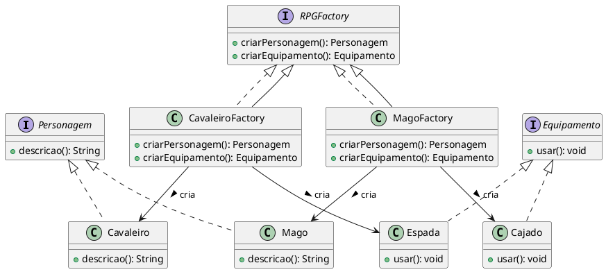
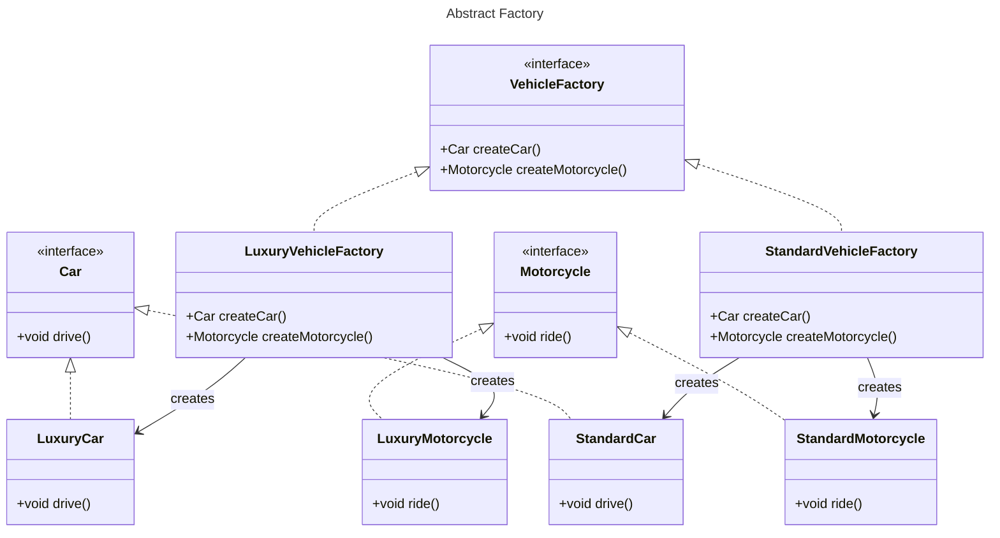

# Abstract Factory

## Brenda Gabriela Martinez Araújo (20221TADSSAJ0001) 

[@Brenda-Martinez](https://github.com/Brenda-Martinez)

<!-- @include: ../../../includes/seminario-1-Brenda-Martinez/README.md -->

## João Augusto

<figure>
  

</figure>
## Gabriel Lima

