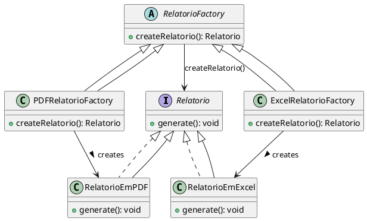

# Factory Method

## Árlei Nóbrega Oliveira (20221TADSSAJ0012) 

[@Arlei10](https://github.com/Arlei10)

<!-- @include: ../../../includes/factory_method/seminario-1-Arlei10/README.md -->

## José Victor Oliveira dos Santos (20212TADSSAJ0008) 

[@zevictoros](https://github.com/zevictoros) 

<!-- @include: ../../../includes/factory_method/seminario-1-zevictoros/README.md -->

## WALLACE SELES NEVES

## João Augusto

<figure>

</figure>
