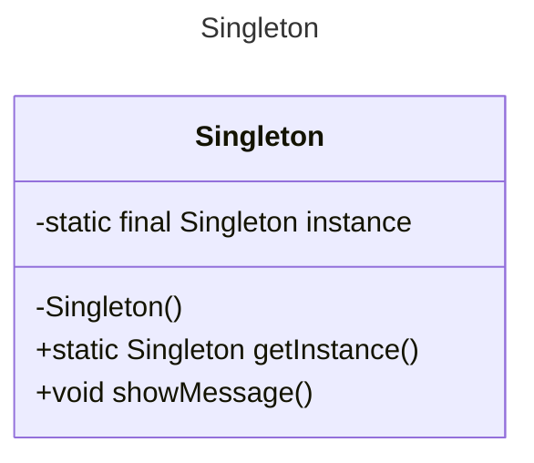

# Singleton
## Guilherme Sampaio Oliveira (20221TADSSAJ0011)
[@GuiSamp](https://github.com/GuiSamp)

<!-- @include: ../../../includes/seminario-1-GuiSamp/README.md -->

## Rian Silva da Fonseca (20221TADSSAJ0002)
[@RiansFonseca](https://github.com/RiansFonseca)

<!-- @include: ../../../includes/seminario-1-RiansFonseca/README-SINGLETON.md -->

## Gabriel LimA

